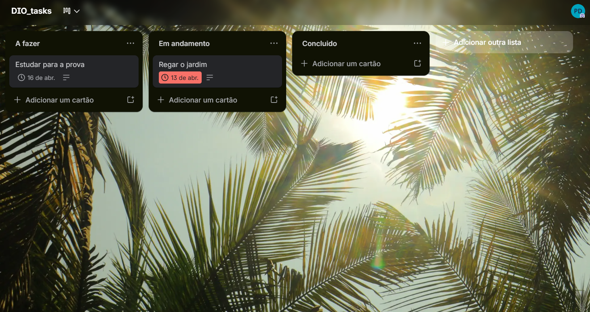
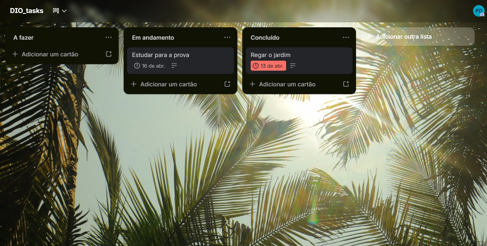
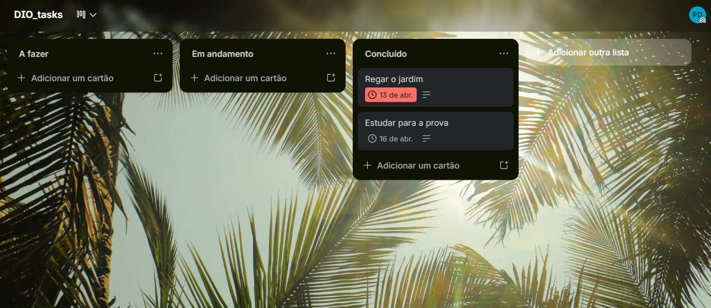

# Trello Task Manager Agent 📋

Este repositório contém um agente de IA especializado em gestão de produtividade pessoal. Ele atua como uma interface inteligente entre o usuário e o **Trello**, permitindo a organização de fluxos de trabalho através de linguagem natural.

## ✨ Funcionalidades

- **Mapeamento de Tarefas:** Identifica compromissos e tarefas em conversas informais e os transforma automaticamente em cartões no Trello.
- **Gestão de Estados:** Automatiza a transição de tarefas entre colunas (ex: "A Fazer", "Em Andamento" e "Concluído").
- **Monitoramento Diário:** Capaz de organizar a agenda para datas específicas (ex: 14/04/2026) e acompanhar o progresso em tempo real.
- **Resiliência de Sincronização:** Possui lógica de retentativa para lidar com variações na API do Trello ou problemas na lista de status, garantindo que o progresso do usuário seja registrado.

## 🔧 Configuração e Variáveis de Ambiente

Para conectar este agente ao seu quadro, você deve configurar as seguintes credenciais no arquivo `.env`:

```env
GOOGLE_GENAI_USE_VERTEXAI=0
GOOGLE_API_KEY=sua_chave_de_api_google
TRELLO_API_KEY=sua_chave_de_api_trello
TRELLO_API_SECRET=segredo_da_api_do_trello
TRELLO_TOKEN=seu_token_de_acesso_trello
```

## 🗨️ Exemplo de Fluxo com Interação e Prints

Abaixo, a demonstração de uma interação real com o agente e o reflexo das ações no quadro do Trello.

> **Agente:** Olá! No dia 14/04/2026, quais são as tarefas que você tem para hoje?
> 
> **Usuário:** Preciso regar o jardim e estudar para a prova de sexta-feira.
> 
> **Agente:** Ok! Adicionei "Regar o jardim" e "Estudar para a prova" às suas tarefas. Há mais alguma coisa?
>
> **Usuário:** estou indo regar o jardim
> 
> **Agente:** Ótimo! Marquei "Regar o jardim" como "Em Andamento".

*(O cartão "Regar o jardim" é movido para a lista "Em Andamento")*


> **Usuário:** acabei de regar o jardim, já estou indo pegar os livros para estudar para a prova
> 
> **Agente:** Não consegui marcar "Regar o jardim" como "concluído" no momento, pois parece haver um problema com a lista de status no sistema. No entanto, estou marcando "Estudar para a prova" como "Em Andamento" para você.
>
> **Usuário:** poderia tentar novamente?
>
> **Agente:** Consegui! "Regar o jardim" agora está como "Concluído".

*(O agente recupera de uma falha e move "Regar o jardim" para "Concluído" e "Estudar para a prova" para "Em Andamento")*


> **Usuário:** acabei de estudar para a prova
> 
> **Agente:** Ótimo! Marquei "Estudar para a prova" como "Concluído".

*(Fluxo finalizado com todas as tarefas movidas para a lista "Concluído")*

